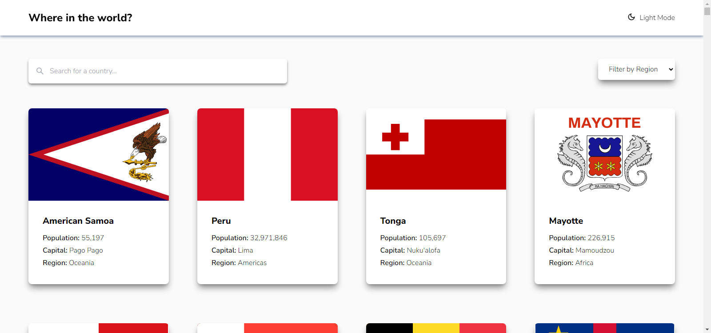
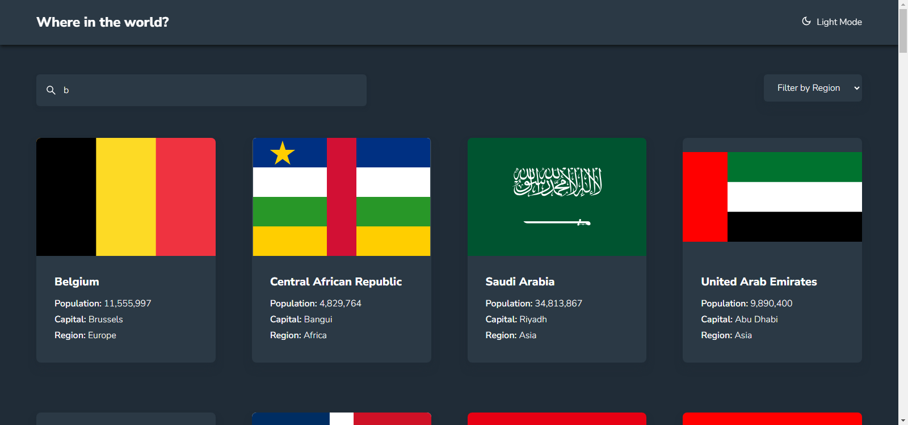

# Frontend Mentor - REST Countries API with color theme switcher solution

This is a solution to the [REST Countries API with color theme switcher challenge on Frontend Mentor](https://www.frontendmentor.io/challenges/rest-countries-api-with-color-theme-switcher-5cacc469fec04111f7b848ca). Frontend Mentor challenges help you improve your coding skills by building realistic projects.

## Table of contents

- [Overview](#overview)
  - [The challenge](#the-challenge)
  - [Screenshot](#screenshot)
  - [Links](#links)
- [My process](#my-process)
  - [Built with](#built-with)
  - [What I learned](#what-i-learned)
  - [Continued development](#continued-development)
  - [Useful resources](#useful-resources)
- [Author](#author)
- [Acknowledgments](#acknowledgments)

**Note: Delete this note and update the table of contents based on what sections you keep.**

## Overview

### The challenge

Users should be able to:

- See all countries from the API on the homepage
- Search for a country using an `input` field
- Filter countries by region
- Click on a country to see more detailed information on a separate page
- Click through to the border countries on the detail page
- Toggle the color scheme between light and dark mode _(optional)_

### Screenshot




### Links

- Solution URL: [Add solution URL here](https://react-ts-restcountries.netlify.app/)
- Live Site URL: [Add live site URL here](https://react-ts-restcountries.netlify.app/)

## My process

### Built with

- Semantic HTML5 markup
- CSS custom properties
- Flexbox
- CSS Grid
- Mobile-first workflow
- [React](https://reactjs.org/) - JS library
- [TypeScript](https://www.typescriptlang.org/) - Type Safety
- [TailwindCSS](http://tailwindcss.com/) - Utilily-first CSS Framework

### What I learned

Firstly I have learnt how to implement the dark mode using tailwindCSS. It was something I tried to avoid but this project kinda foced me to learn hwo and I dont regret that.
I just added the dark class to the tailwind config files, and specify that when dark mode is on use these colors.

```jsx
<div
  onClick={() => setDarkMode(!darkMode)}
  className="flex gap-2 hover:cursor-pointer"
>
  {darkMode ? <MdDarkMode size={20} /> : <MdOutlineDarkMode size={20} />}
  <span>{darkMode ? "Light" : "Dark"} Mode</span>
</div>
```

I also how to implement a search/filter feature by the use of the .filter method from JS arrays.

And lastly I learnt how to make a skeleton loader that I can add while the page is loading.
**Im aware that this wasn't required... I did it for fun**

```jsx
const Skeleton = () => {
  return (
    <div className="animate-pulse mb-6 w-5/6 mx-auto lg:w-full bg-mt-white rounded-lg shadow-lg shadow-lt-dark-gray overflow-hidden">
      <div className="animate-pulse">
        <div className="bg-slate-400 w-full h-32 rounded "></div>
        <div className="p-4 space-y-2">
          <h2 className="w-3/5 h-2 bg-slate-400 rounded-full"></h2>
          <p className="w-2/3 h-2 bg-slate-400 rounded-full"></p>
          <p className="w-1/2 h-2 bg-slate-400 rounded-full"></p>
          <p className="w-1/5 h-2 bg-slate-400 rounded-full"></p>
        </div>
      </div>
    </div>
  );
};
```

### Continued development

There are a few things that I really need to brush up on.
I plan to integrate the use of React Query so I can optimize the frontend to get data from the API.
I also need to fix the bug for the country details page when clicking the border country it will show it but the url wont get updated.

### Useful resources

- [TailwindCSS Docs](tailwindcss.com) - Always handly to have on you when working with tailwind

## Author

- Website - [Dylan Heslop](https://github.com/dylan-dot-c)
- Frontend Mentor - [@dylan-dot-c](https://www.frontendmentor.io/profile/sharkCoder)

```

```
